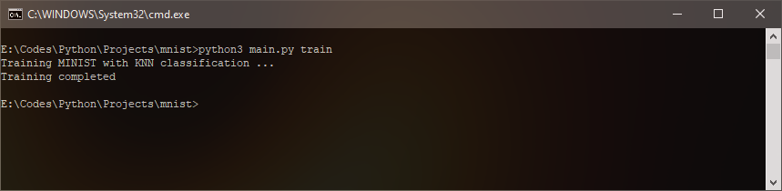
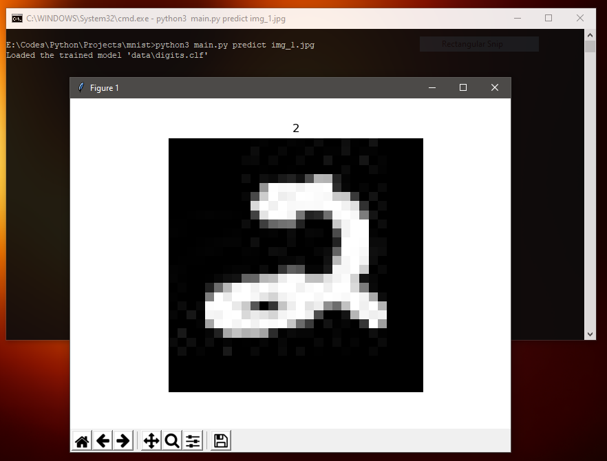
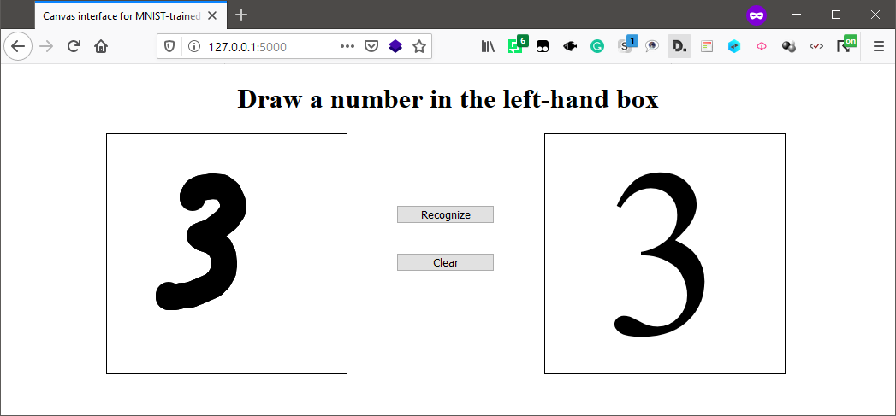
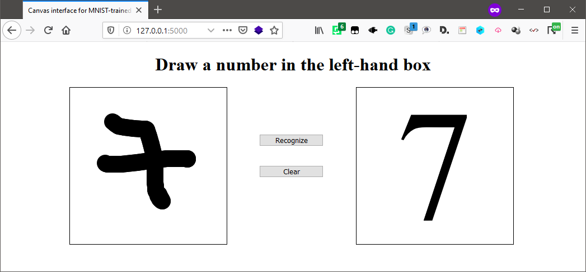

### MNIST - KNN (K-Nearest Neighbor) ###

#### The prediction algorithm based on the KNN (K-Nearest Neighbor) algorithm for this dataset ####

*Thanks [@marcotompitak](https://github.com/marcotompitak) for Simple Flask Web Canvas UI*
_ _ _

##### INSTALLATION #####

> $ pip3 install -r requirements.txt
>
> $ Note: The [PyVutils](https://github.com/vic4key/PyVutils) library can be found on GitHub

##### COMMANDS #####

> $ python3 main.py train
>
> $ python3 main.py predict img_1.jpg

> $ python3 main.py web

##### SCREENSHOTS #####

_ _ _

Website: https://vic.onl/